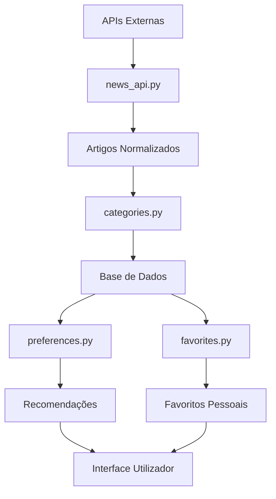

# Módulos do Sistema de Notícias 📰

Sistema completo para gestão de notícias no NeuralNews com APIs externas, categorização automática, preferências de utilizador e favoritos.

## 📁 Estrutura dos Módulos

```
backend/
├── news_api.py      # 🌐 Consumo de APIs de notícias
├── categories.py    # 📂 Categorização e filtragem
├── preferences.py   # ⚙️ Preferências dos utilizadores
└── favorites.py     # ⭐ Gestão de favoritos
```

---

## 🌐 news_api.py - Consumo de APIs

### Funcionalidades
- **Múltiplas APIs**: NewsAPI, Guardian, feeds RSS
- **Cache inteligente**: 5 minutos por padrão
- **Normalização**: Formato padrão para todos os artigos
- **Tratamento de erros**: Timeout, rate limit, API keys
- **Validação**: Artigos com dados mínimos necessários

### Uso Básico
```python
from backend.news_api import NewsAPIManager

api = NewsAPIManager()

# NewsAPI.org
articles, message = api.fetch_newsapi_articles(
    api_key="sua_chave_aqui",
    category="technology",
    language="pt",
    page_size=20
)

# The Guardian
articles, message = api.fetch_guardian_articles(
    api_key="sua_chave_guardian", 
    section="technology"
)

# RSS Feeds
rss_urls = [
    'https://feeds.bbci.co.uk/news/rss.xml',
    'https://rss.cnn.com/rss/edition.rss'
]
articles, message = api.fetch_rss_articles(rss_urls, max_articles=50)
```

### Formato de Artigo Normalizado
```python
{
    'id': 12345,
    'title': 'Título do Artigo',
    'description': 'Descrição breve...',
    'url': 'https://exemplo.com/artigo',
    'source': 'Nome da Fonte',
    'image_url': 'https://exemplo.com/imagem.jpg',
    'published_at': datetime,
    'author': 'Nome do Autor',
    'content': 'Conteúdo resumido...',
    'category': 'tecnologia',
    'language': 'pt',
    'api_source': 'newsapi'
}
```

### Cache e Performance
```python
# Limpar cache
api.clear_cache()

# Estatísticas do cache
stats = api.get_cache_stats()
print(f"Cache hit ratio: {stats['cache_hit_ratio']:.2%}")
```

---

## 📂 categories.py - Categorização

### Funcionalidades
- **Categorização automática**: Por palavras-chave em português
- **Gestão de categorias**: CRUD completo
- **Filtragem avançada**: Por categoria, data, palavras-chave
- **Estatísticas**: Categorias em alta, distribuição
- **Pesquisa**: Busca em títulos e descrições

### Categorias Pré-definidas
- **Tecnologia**: IA, software, startups, cibersegurança
- **Política**: governo, eleições, diplomacia, leis  
- **Economia**: mercados, empresas, emprego, inflação
- **Desporto**: futebol, liga, campeonatos, clubes portugueses
- **Saúde**: medicina, COVID, investigação médica
- **Ciência**: descobertas, astronomia, energia renovável
- **Cultura**: arte, música, cinema, literatura
- **Internacional**: diplomacia, países, conflitos globais
- **Local**: Portugal, cidades, municípios, autarquias
- **Ambiente**: sustentabilidade, clima, conservação

### Uso Básico
```python
from backend.categories import CategoryManager

cat_manager = CategoryManager()

# Listar todas as categorias
categories, message = cat_manager.get_all_categories()

# Categorização automática
category_name = cat_manager.categorize_article(
    title="Nova startup portuguesa de IA levanta 5M€",
    description="Empresa desenvolve soluções de machine learning...",
    content="..."
)
print(category_name)  # "tecnologia"

# Filtrar notícias por categoria
news, message = cat_manager.filter_news_by_category(
    category_id=1, 
    limit=20
)

# Categorias em alta
trending, message = cat_manager.get_trending_categories(days=7)
```

### Pesquisa Avançada
```python
# Buscar por palavras-chave
results, message = cat_manager.search_news_by_keywords(
    keywords="inteligência artificial",
    category_id=1,  # Apenas em Tecnologia
    limit=30
)

# Estatísticas
stats, message = cat_manager.get_category_statistics()
```

---

## ⚙️ preferences.py - Preferências

### Funcionalidades
- **Categorias preferidas**: Gestão de preferências por categoria
- **Fontes favoritas**: NewsAPI, Guardian, portais portugueses
- **Recomendações**: Artigos baseados no perfil
- **Configurações**: Idioma, frequência, modo escuro
- **Estatísticas**: Análise do perfil de leitura
- **Import/Export**: Backup das preferências

### Fontes Disponíveis
```python
{
    'rtp': 'RTP Notícias',          # Português, alta confiabilidade
    'publico': 'Público',           # Português, jornal independente  
    'observador': 'Observador',     # Portal português
    'bbc': 'BBC News',              # Internacional, inglês/português
    'guardian': 'The Guardian',     # Internacional, inglês
    'newsapi': 'News API'           # Agregador global
}
```

### Uso Básico
```python
from backend.preferences import PreferencesManager

pref_manager = PreferencesManager()

# Obter preferências do utilizador
prefs, message = pref_manager.get_user_preferences(user_id=1)

# Adicionar categoria preferida
success, message = pref_manager.add_preferred_category(
    user_id=1, 
    category_id=3
)

# Definir categorias (substitui existentes)
success, message = pref_manager.set_preferred_categories(
    user_id=1,
    category_ids=[1, 3, 5, 7]  # Tecnologia, Política, Saúde, Cultura
)

# Artigos recomendados
recommendations, message = pref_manager.get_recommended_articles(
    user_id=1,
    limit=15
)
```

### Recomendações Inteligentes
```python
# Sugerir novas categorias
suggestions, message = pref_manager.suggest_categories(user_id=1)

# Fontes recomendadas baseadas nas preferências
sources, message = pref_manager.get_user_source_preferences(user_id=1)

# Estatísticas de leitura
stats, message = pref_manager.get_reading_statistics(user_id=1, days=30)
```

---

## ⭐ favorites.py - Gestão de Favoritos

### Funcionalidades
- **Adicionar favoritos**: Artigos internos ou externos
- **Organização**: Tags, categorias, notas pessoais
- **Estado de leitura**: Marcar como lido/não lido
- **Pesquisa**: Por título, descrição, tags, notas
- **Estatísticas**: Análise dos hábitos de favoritos
- **Export**: Backup completo dos favoritos

### Uso Básico
```python
from backend.favorites import FavoritesManager

fav_manager = FavoritesManager()

# Adicionar artigo interno aos favoritos
success, message = fav_manager.add_favorite_by_news_id(
    user_id=1,
    news_id=123,
    notes="Artigo interessante sobre IA",
    tags=["ia", "portugal", "startup"]
)

# Adicionar artigo externo
success, message = fav_manager.add_favorite_by_url(
    user_id=1,
    url="https://exemplo.com/artigo",
    title="Artigo Externo Importante",
    description="Descrição do artigo...",
    source="Site Externo",
    category="tecnologia",
    tags=["pesquisa", "importante"]
)
```

### Gestão Avançada
```python
# Listar favoritos do utilizador
favorites, message = fav_manager.get_user_favorites(
    user_id=1,
    category="tecnologia",  # Filtrar por categoria
    limit=20,
    sort_by="added_at",
    order="DESC"
)

# Marcar como lido
success, message = fav_manager.mark_as_read(
    user_id=1, 
    favorite_id=5, 
    is_read=True
)

# Atualizar notas
success, message = fav_manager.update_favorite_notes(
    user_id=1,
    favorite_id=5,
    notes="Artigo muito útil para o projeto"
)

# Adicionar/editar tags
success, message = fav_manager.update_favorite_tags(
    user_id=1,
    favorite_id=5,
    tags=["ai", "machine-learning", "research", "importante"]
)
```

### Pesquisa e Análise
```python
# Pesquisar nos favoritos
results, message = fav_manager.search_favorites(
    user_id=1,
    search_term="inteligência artificial",
    search_in=["title", "description", "notes", "tags"]
)

# Obter todas as tags utilizadas
tags, message = fav_manager.get_all_tags(user_id=1)

# Estatísticas dos favoritos
stats, message = fav_manager.get_favorites_statistics(user_id=1)
```

### Estrutura da Tabela Favorites
```sql
CREATE TABLE favorites (
    id INTEGER PRIMARY KEY AUTOINCREMENT,
    user_id INTEGER NOT NULL,
    news_id INTEGER,                -- Artigo interno
    external_url TEXT,              -- Artigo externo
    title TEXT NOT NULL,
    description TEXT,
    source TEXT,
    image_url TEXT,
    category TEXT DEFAULT 'geral',
    added_at DATETIME DEFAULT CURRENT_TIMESTAMP,
    is_read BOOLEAN DEFAULT FALSE,
    notes TEXT,                     -- Notas pessoais
    tags TEXT,                      -- Tags separadas por vírgula
    FOREIGN KEY (user_id) REFERENCES users(id),
    FOREIGN KEY (news_id) REFERENCES news(id)
);
```

---

## 🔧 Configuração e Dependências

### Dependências Adicionais
```bash
pip install requests feedparser
```

### Chaves de API Necessárias

1. **NewsAPI** (opcional)
   - Registar em: https://newsapi.org/
   - Limite grátis: 1000 requests/dia
   
2. **Guardian API** (opcional)  
   - Registar em: https://open-platform.theguardian.com/
   - Limite grátis: 5000 requests/dia

### Variáveis de Ambiente
```bash
NEWSAPI_KEY=sua_chave_newsapi_aqui
GUARDIAN_API_KEY=sua_chave_guardian_aqui
```

---

## 📊 Fluxo de Dados Completo



1. **news_api.py** busca artigos de múltiplas fontes
2. **categories.py** categoriza e filtra automaticamente  
3. Artigos são salvos na base de dados
4. **preferences.py** analisa perfil do utilizador
5. **favorites.py** gere artigos salvos pelo utilizador
6. Sistema gera recomendações personalizadas

---

## 🚀 Integração com Flask

### Exemplo de Rotas
```python
# app.py
from backend.news_api import NewsAPIManager
from backend.categories import CategoryManager
from backend.preferences import PreferencesManager
from backend.favorites import FavoritesManager

@app.route('/api/news/fetch')
@login_required
def fetch_latest_news():
    api = NewsAPIManager()
    articles, message = api.fetch_newsapi_articles(
        api_key=app.config['NEWSAPI_KEY'],
        category=request.args.get('category'),
        language='pt'
    )
    return jsonify({'articles': articles, 'message': message})

@app.route('/api/user/recommendations')
@login_required  
def get_recommendations():
    pref_manager = PreferencesManager()
    articles, message = pref_manager.get_recommended_articles(
        user_id=session['user_id'],
        limit=20
    )
    return jsonify({'articles': articles})

@app.route('/api/favorites', methods=['POST'])
@login_required
def add_favorite():
    fav_manager = FavoritesManager()
    data = request.get_json()
    
    success, message = fav_manager.add_favorite_by_news_id(
        user_id=session['user_id'],
        news_id=data['news_id'],
        notes=data.get('notes', ''),
        tags=data.get('tags', [])
    )
    
    return jsonify({'success': success, 'message': message})
```

---

## 📈 Performance e Boas Práticas

### Cache Estratégico
- **news_api.py**: Cache de 5 minutos para APIs externas
- **Agregação**: Processar múltiplas fontes em paralelo
- **Paginação**: Limitar resultados por requisição

### Base de Dados
- **Índices**: Em `published_at`, `category_id`, `user_id`
- **Limpeza**: Remover notícias antigas periodicamente
- **Backup**: Export regular das preferências e favoritos

### Monitorização
```python
# Verificar saúde das APIs
api = NewsAPIManager()
cache_stats = api.get_cache_stats()

# Estatísticas do sistema
cat_manager = CategoryManager()
stats, _ = cat_manager.get_category_statistics()
```

---

🎉 **Sistema completo de notícias implementado!** 

Todos os módulos trabalham em conjunto para fornecer uma experiência personalizada de consumo de notícias.